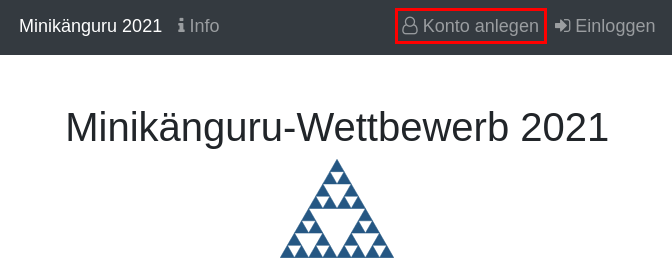

Minikänguru Benutzerkonten
==========================
Heike Winkelvoß <info@egladil.de>
:Author Initials: HW
:toc:
:icons:
:numbered:
:website: https://mathe-jung-alt.de/
:imagesdir: /home/heike/git/minikaenguru/documentation
:toc-title: Inhaltsverzeichnis

.Dieses Dokument
****************************************************************************************************
Dieses Dokument beschreibt, wie Sie ein Benutzerkonto für den Minikänguru-Wettbewerb anlegen können.
****************************************************************************************************

Lehrerkonto erstellen
---------------------

Rufen Sie die https://mathe-jung-alt.de/mkv-app[Startseite] der Minikänguru-Anwendung auf

Um ein Konto anzulegen, klicken Sie bitte auf den Menüpunkt "Konto anlegen", der im Bild rot umrandet ist.

Es öffnet sich folgende Maske:

Sie können auswählen, ob Sie Mailbenachrichtigungen erhalten möchten. Informationen hierzu sehen Sie nach
einem Klick auf "Info". Nach dem Anlegen des Kontos können Sie Ihre Entscheidung jederzeit ändern.

Klicken Sie nun auf die Schaltfläche "Lehrer/Lehrerin". Es wird ein Suchfenster eingeblendet, in dem Sie
über Ihren Ort Ihre Schule finden und auswählen können:

image::./images/lehrerkonto-ortsuche.png[width=50%]

Sie starten die Suche, indem Sie mindestens die ersten 3 Buchstaben Ihres Ortes in das Eingabefeld eintragen.

Wurden Orte gefunden, wird anschließend eine Trefferliste eingeblendet:

image::./images/lehrerkonto-orte.png[width=50%]

Wählen Sie hier Ihren Ort durch Klick auf die Kachel mit dem Ort aus. Hat der Ort nur wenige Schulen, wird
nun die Liste der Schulen dieses Ortes angezeigt:

image::./images/lehrerkonto-schulen.png[width=50%]

Anderenfalls sehen sie wieder ein Eingabefeld, in dem Sie nun 3 aufeinanderfolgende Buchstaben des Namens
Ihrer Schule eingeben können, um Ihre Schule zu finden.

Wählen Sie nun Ihre Schule durch Klick auf die entsprechende Kachel aus,

image::./images/lehrerkonto-schule-ausgewaehlt.png[width=50%]

und klicken Sie anschließend auf die Schaltfläche "Konto anlegen". Sie werden auf eine Webseite umgeleitet, auf der Sie ein
neues Benutzerkonto anlegen können.

*Hinweis:* Diese Webseite unterliegt den gleichen Datenschutzbestimmungen wie die
Webseite des Minikänguru-Wettbewerbs, da sie ebenfalls mir gehört.

Nach dem Ausfüllen und Absenden des Formulars mit den erforderlichen Daten für ein Lehrerkonto werden Sie in die
Minikänguru-Anwendung zurückgeleitet. Sie erhalten einen 24h gültigen Link zum Aktivieren Ihres Benutzerkontos
an die Mailadresse, die Sie beim Anlegen des Kontos angegeben haben. Erst nach der erfolgreichen Kontoaktivierung
können Sie sich einloggen.

