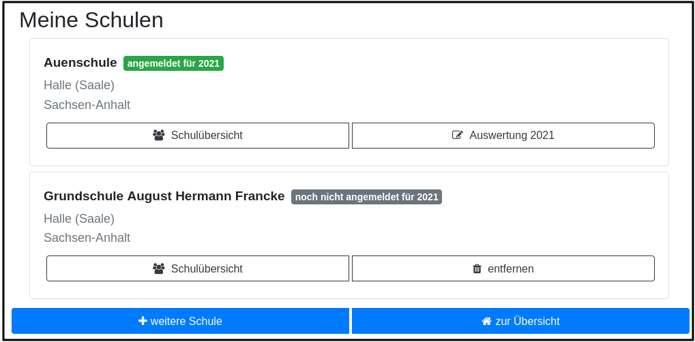
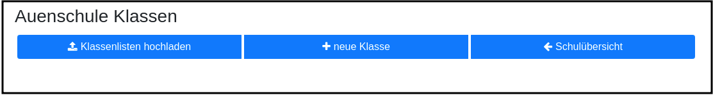
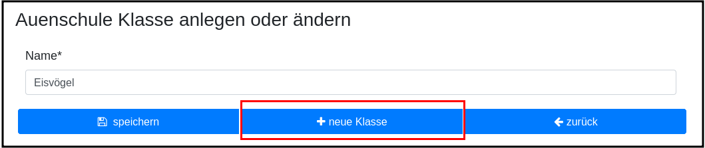
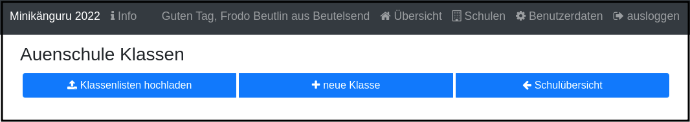
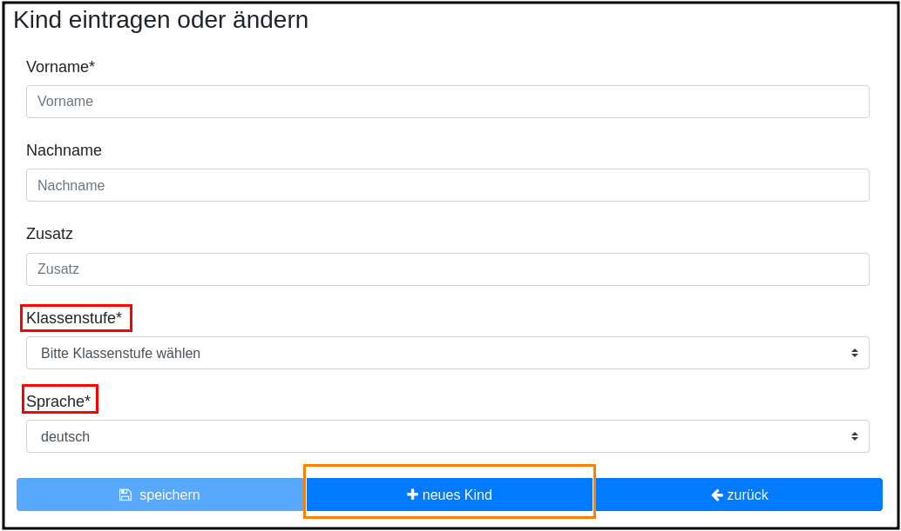
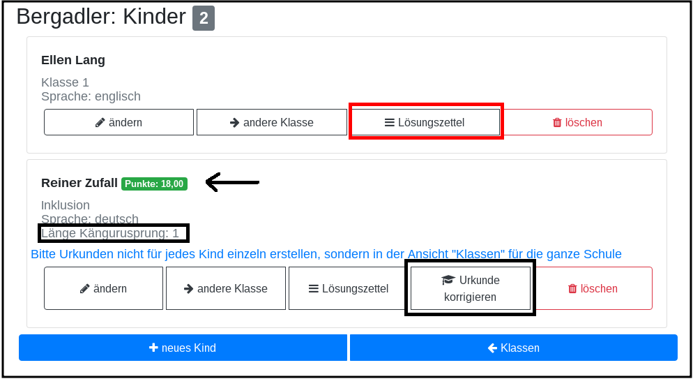

Minikänguru-Anwendung für Lehrerinnen und Lehrer
================================================
Heike Winkelvoß
:Author Initials: HW
:toc:
:icons:
:numbered:
:website: https://mathe-jung-alt.de/
:imagesdir: /home/heike/git/minikaenguru/documentation
:toc-title: Inhaltsverzeichnis

.Dieses Dokument
***********************************************************************************************
Dieses Dokument beschreibt alle Funktionen, die Sie benötgen, um den Minikänguru-Wettbewerb an
Ihrer Schule zu organisieren.

Er wird in den kommenden Monaten zusammen mit der Anwendung vervollständigt.
***********************************************************************************************

Um Die Minikänguru-Anwendung nutzen zu können, benötigen Sie ein Lehrerkonto.

Die Schritte zur Erstellung eines Lehrerkontos sind in einem anderen Dokument beschrieben.

Eine Schule anmelden
--------------------

Rufen Sie die https://mathe-jung-alt.de/mkv-app[Startseite] der Minikänguru-Anwendung auf

image::./images/startseite-hauptmenue-login.png[width=60%]

Mit einem Klick auf den Menüpunkt "einloggen", der im Bild blau umrandet ist, gelangen Sie in ein
Formular, in dem Sie Ihre Mailadresse und Ihr Passwort eingeben.

Waren ie Angaben korrekt, gelangen Sie auf Ihre Übersichtsseite:

image::./images/dashboard-lehrer.png[width=75%]

Die Kachel "Unterlagen XXXX" sehen Sie nur dann, wenn Sie Ihre Schule (bei mehreren Schulen mindestens eine Schule)
für das aktuelle Wettbewerbsjahr angemeldet haben und Die Unterlagen zum Herunterlagen freigeschaltet sind. Die Termine, an denen die Unterlagen freigeschaltet werden,
werden in der Startseite der Minikänguru-Anwendung angezeigt. Wenn Sie eingeloggt sind, können Sie sich die Termine durch Klick auf den Menüpunkt "Info"
anzeigen lassen.

Da Sie mit der neuen Minikänguru-Anwendung mit einem Lehrerkonto mehrere Schulen verwalten können,
sehen Sie auf der Übersichtsseite eine Kachel mit der Aufschrift "Meine Schulen"

Nach Klick auf diese Kachel sehen Sie eine Liste Ihrer Schulen:

Hier sehen Sie die Schulen, bei denen Sie sich als Lehrerin / Lehrer eingetragen haben und welche dieser
Schulen bereits für den laufenden Minikänguru-Wettbewerb angemeldet sind.

Um eine noch nicht angemeldete Schule anzumelden, klicken Sie bitte auf den Button "Schulübersicht" dieser Schule.

Sie gelangen auf die Übersichtsseite der gewählten Schule:

image::./images/schuluebersicht-nicht-angemeldet.png[width=75%]

Wenn der Anmeldezeitraum begonnen hat, sehen Sie eine Kachel mit der Aufschrift "Anmelden". Sie melden
die Schule für den laufenden Wettbewerb durch einen Klick auf diese Kachel an.

*Die Anmeldung ist unverbindlich.* Falls Sie später am laufenden Wettbewerb doch nicht teilnehmen können,
ist das unkritisch.

Nach der Anmeldung Ihrer Schule zum laufenden Wettbewerb, sehen Sie auf der Übersichtsseite der Schule weitere
Kacheln mit denen Sie Funktionen aufrufen können, die Sie bei der Durchführung des Wettbewerbs an Ihrer Schule
unterstützen:

image::./images/schuluebersicht-angemeldet.png[width=75%]

Eigene Schulen
--------------

Mit der neuem Version der Minikänguru-Anwendung können Sie mit einem Benutzerkonto mehrere Schulen verwalten.

*Bitte beachten Sie:* Den Lehrerinnen bzw. Lehrern, die für die jeweilige Schule ebenfalls angemeldet sind, wird Ihr Name
auf der Übersichtsseite der Schule angezeigt.

Der Einstieg in die Schulliste erfolgt von Ihrer Startseite, die Sie nach dem Einloggen sehen, mit einem Klick auf die Kachel
"Meine Schulen" oder jederzeit über den Menüpunkt "Schulen" im Hauptmenü.

Beide Aktionen öffnen Ihre Schulliste:

Mit einem Klick auf die (im Bild schwarz umrandete) Schaltfläche "weitere Schule" können Sie sich an einer weiteren
Schule als Lehrerin bzw. Lehrer registrieren und so den Wettbewerb auch für diese Schule organisieren.

Die Auswahl einer weiteren Schule wird später in einem anderen Dokument beschrieben.

Je nach dem, ob Ihre Schule bereits zum laufenden Wettbewerb angemeldet ist oder nicht, haben Sie in der Schulliste verschiedene
Optionen. Sie können

* die Übersichtsseite der Schule aufrufen (im Bild: rot umrandete Schaltfläche)
* zur Auswertung des laufenden Wettbewerbs an dieser Schule wechseln (im Bild: blau umrandete Schaltfläche)
* sich als Lehrerin / Lehrer von einer Schule abmelden (im Bild: orange umrandete Schaltfläche)

Klassen- und Kinderdaten pflegen
--------------------------------

Derzeit noch in Arbeit ist eine Funktion, mit der Sie die Daten Ihrer Klassen und Kinder mit einer Excel-Tabelle hochladen können.
Sie kennen eine ähnliche Funktion vielleicht bereits vom Känguru-Wettbewerb. Die Fertigstellung dieser Funktion ist 2022 geplant.

Klassen anlegen und ändern
~~~~~~~~~~~~~~~~~~~~~~~~~~

Um Klassen anzulegen oder zu bearbeiten, gibt es 2 Einstiegspunkte:

* klick auf die Kachel "Auswertung" in der Schulübersicht (im Bild blau umrandet):

* klick auf die Schaltfläche "Auswertung" in der Schulliste (im Bild blau umrandet):

Sie gelangen in die Klassenliste, die zunächst leer ist:

Eine neue Klasse erfassen Sie nach einem Klick auf die Schaltfläche "neue Klasse":

Die Auswahl einer Klassenstufe ist dabei *nicht* erforderlich. D.h., Sie können jetzt auch Klassen mit gemischten Klassenstufen
anlegen.

Sie können alle Klassen zügig nacheinander anlegen, indem Sie jeweils nach dem Speichern die Schaltfläche "neue Klasse"
(im Bild rot umrandet) erneut anklicken

Mit Klick auf die Schaltfläche "zurück" gelangen Sie zurück in Ihre Klassenliste:

Für jede Klasse haben Sie folgende Optionen:

* umbenennen (Schaltfläche "Name ändern")
* Kinder eintragen oder bearbeiten (Schaltfläche "Kinder bearbeiten")
* löschen (Schaltfläche "löschen")

Sie können jede Klasse löschen, also auch Klassen, zu denen bereits Kinder eingetragen wurden. In diesem Fall öffnet sich ein
Warndialog, denn es wird dann nicht nur die Klasse vollständig gelöscht, sondern auch alle Kinder dieser Klasse:

Beim Löschen einer Klasse ohne Kinder erscheint kein Warndialog.

Kinder anlegen und ändern
~~~~~~~~~~~~~~~~~~~~~~~~~~

Um zu einer Klasse Kinder zu erfassen oder die Kinder einer Klasse zu bearbeiten, klicken Sie in der Klassenliste auf
der Kachel der Klasse bitte auf die Schaltfläche "Kinder bearbeiten", die im Bild rot umrandet gezeigt ist:

Sie gelangen in die Kinderliste der gewählten Klasse:

image::./images/kinder-bearbeiten.png[width=60%]

Ein neues Kind erfassen Sie nach dem Klick auf die Schaltfläche "neues Kind":

Pflichtfelder sind:

* Vorname
* Klassenstufe
* Sprache

*Welche Daten werden auf die Urkunde gedruckt?*

Der Name der Klasse, zu der ein Kind gehört, erscheint auf der Urkunde. Abhängig von den übrigen Daten, die sie für die Kinder erfassen, erscheinen:

* der vollständige Name, wenn Sie für ein Kind den Vornamen *und* den Nachnamen eingetragen haben
* nur der Vorname, wenn Sie für ein Kind nur den Vornamen eingetragen haben.

Der Zusatztext erscheint *nicht auf der Urkunde*.

Nachdem alle Pflichtfelder gefüllt sind, können Sie das Kind durch Klick auf die Schaltfläche "speichern" speichern.

Sie können alle Kinder einer Klasse zügig nacheinander erfassen, indem Sie nach dem Speichern sofort auf die Schaltfläche
"neues Kind" (im Bild orange umrandet) klicken.

Dabei werden die gewählte Klassenstufe und die gewählte Sprache von der vorherigen Auswahl übernommen, da diese
sich in den meisten Fällen nicht ändern.

*Tipp:* Indem Sie in einer Klasse mit gemischten Klassenstufen die Kinder der gleichen Klassenstufe nacheinander
anlegen, kommen Sie mit den wenigsten Klicks beim Anlegen der Kinder aus.

Mit einem Klick auf die Schaltfläche "zurück" gelangen Sie zurück in die Klassenübersicht:

image::./images/kinderliste.png[width=60%]

Alle Kinder der Klasse werden nach Vornamen und Nachnamen sortiert in je einer Kachel angezeigt.

Sie können durch Klick auf die entsprechenden Schaltflächen in der Kachel eines Kindes

* die Daten dieses Kindes ändern (Schaltfläche "ändern")
* das Kind in eine andere Klasse verschieben (Schaltfläche "andere Klasse")
* den Lösungszettel dieses Kindes erfassen (Schaltfläche
* die Urkunde dieses Kindes noch einmal ausdrucken (Schaltfläche "Urkunde korrigieren")
* das Kind löschen (Schaltfläche "löschen")

*Hinweis:* Die Schaltflächen "Lösungszettel" und "Urkunde korrigieren" sind nur sichtbar, wenn die Unterlagen zum Herunterladen bereitgestellt worden sind.

Das Löschen eines Kindes bestätigen Sie bitte extra in dem Warndialog, der nach Klick auf "löschen" angezeigt wird:

*Mehrfacherfassungen vermeiden - der Zusatztext*

In der Schulübersicht, die Sie während der automatischen Auswertung des Wettbewerbs Ihrer Schule erstellen, werden je
Klasse alle Kinder mit Vorname, Nachname (falls eingegeben), Zusatztext (falls eingegeben) und Klassenstufe aufgelistet.

Kinder einer Klasse die in diesen Merkmalen übereinstimmen, können daher in der Schulübersicht nicht unterschieden
werden.

Kinder werden als gleich angesehen, wenn sie

* zu gleichen Klasse geören *und*
* die gleiche Klassenstufe haben *und*
* in Vorname, Nachname *und* Zusatztext übereinstimmen.

Falls Sie also Ihre Kinder nur mit dem Vornamen erfassen möchten, kann es vorkommen, dass es in einer Klasse mehrere Kinder
mit diesem Vornamen und der gleichen Klassenstufe gibt. Um diese Kinder in der Schulübersicht unterscheiden zu können,
können Sie einen beliebigen Zusatztext eintragen, der Ihnen bei der Unterscheidung der Kinder hilft, damit Sie später
die Urkunden korrekt austeilen können.

Potenziell sind Mehrfacherfassungen sowohl beim Erfassen von Kindern einer Klasse, als auch beim Verschieben von
Kindern zwischen Klassen möglich. Ist das der Fall, wird ein Warndialog angezeigt:

image::./images/mehrfacherfassung-kind.png[width=40%]

Der Warntext enthält dabei jeweils einen kontextbezogenen Hinweis darauf, was Sie tun können, um die Urkunde später dem
richtigen Kind aushändigen zu können. Wählen Sie im gezeigten Beispiel "nein" und tragen einen Text im Eingabefeld "Zusatztext"
ein, so können Sie das Kind anschließend ohne Warnung speichern, da Sie so die Mehrfacherfassung umgangen haben.

*Kinder zwischen Klassen verschieben*

Um ein Kind in eine andere Klasse zu verschieben, klicken Sie in der Klassenliste in der Kachel des Kindes auf die
Schaltfläche "andere Klasse".

Sie gelangen in ein Formuar, in dem Sie die neue Klasse mit einer Auswahlliste wählen können (das Bild zeigt das
Formular, nachdem die neue Klasse ausgewählt wurde).

image::./images/kind-verschieben-nach-auswahl-klasse.png[width=60%]

Beim Klick auf "speichern" wird automatisch überprüft, ob es ein Kind mit gleichem Namen und gleicher Klassenstufe
in der neuen Klasse bereits gibt. In diesem Fall öffnet sich wieder der Warndialog "Merfacherfassung" und Sie können das
Verschieben abbrechen. Falls es kein gleiches Kind in der neuen Klasse gibt, wird das Kind verschoben und sie finden
es anschließend in der Liste der Kinder der neuen Klasse.

Klassen und Kinder mit einer Exceltabelle hochladen
----------------------------------------------------

Diese Funktion ist für 2022 geplant.

Lösungszettel der Kinder erfassen
---------------------------------

Der Einstieg zum Erfassen der Lösungszettel erfolgt über Schulübersicht -> Auswertung -> "Kinder bearbeiten" -> "Lösungszettel"

Kinder, für die Sie bereits einen Lösungszettel erfasst haben, erkennen Sie in der Übersichtt an der grünen Markierung neben dem Namen, die die Punkte anzeigt, der Zeile
mit der Angabe der Länge des Kängurusprungs, sowie der Schaltfläche "Urkunde korrigieren".

Nach Klick auf die Schaltfläche "Lösungszettel" gelangen Sie in das Formular zum Erfassen des Lösungszettels für dieses Kind.
Das Bild zeigt das Formular für ein Inklusionskind, da hier das gesamte Formular in ein Bildschirmfoto passt:

image::./images/loesungszettel-inklusion.png[width=45%]

Sie sehen den Namen des Kindes und eine Tabelle mit den Aufgabennummern. Die Aufgaben in den Kategorien A (leicht), B (mittelschwer) und C (schwer) sind
jeweils mit einer anderen Farbe hinterlegt, um es zu erleichtern, den Überblick zu behalten.
Jede Zeile enthält Ankreuzkästchen, die den Ankreuztabellen auf den Aufgabenzetteln entsprechen.

Sie können also die Antworten der Kinder auf deren Arbeitsblättern einfach in diese Tabelle übertragen, indem Sie in jeder Zeile das Kästchen anklicken,
das das Kind angekreutz hat. Bei nicht gelösten Aufgaben bleibt die entsprechende Zeile leer. Ein versehentlich gesetztes Kreuz in einer Zeile können Sie
durch erneutes Anklicken wieder löschen.

Nachdem der Lösungszettel übertragen wurde, kann er gespeichert werden. Die Anwendung berechnet dann sofort die erreichte
Punktzahl und die Länge des Kängurusprungs.

Hat das Kind einen leeren Lösungszettel abgegeben, so erhält es trotzdem Punkte und eine Urkunde. Daher
ist es möglich, einen leeren Lösungszettel zu speichern.In diesem Fall erscheint ein Warndialog:

image::./images/dialog-leerer-loesungszettel.png[width=70%]

Bestätigen Sie die Frage mit "ja", wird der leere Lösungszettel gespeichert.

Sie können einen Lösungszettel auch jederzeit löschen. Die Löschung erfolgt erst, nachdem Sie einen Warndiaog bestätigt haben.
Die Schaltfläche "löschen" ist nur aktiviert, wenn für das Kind bereits einmal ein Lösungszettel gespeichert wurde.

Nach dem Löschen gelangen Sie automatisch zurück in die Klassenliste.

Sie können aus dem Formular "Lösungszettel" zurück in die Klassenliste gelangen, indem Sie sie Schaltfläche "zurück" anklicken.

*Urkunde korrigieren*

In der Kinderliste einer Klasse gibt es für jedes Kind die Möglichkeit, eine Urkunde zu erstellen (Schaltfläche "Urkunde korrigieren").
Das Erstellen einer Urkunde erfordert mehrere Klicks und daher gibt es diese Möglichkeit für ein einzelnes Kind nur, um eine Urkunde zu
korrigieren, beispielsweise wenn Sie die Auswertung für die Schule mit allen Urkunden bereits erstellt hatten und feststellen, dass Sie sich
beim Namen des Kindes verschrieben haben. Dann können Sie den Namen des Kindes korrigieren und eine einzelne Urkunde für dieses Kind noch einmal ausdrucken.

Bitte verwenden Sie diese Schaltfläche nicht, um für jedes Kind einzeln eine Urkunde zu erstellen. Das würde viel zu lange dauern und Sie bekämen dann auch keine
Gesamtübersicht mit den Platzierungen der Kinder.

