Minikänguru-Anwendung für Schulen
=================================
Heike Winkelvoß
:Author Initials: HW
:toc:
:icons:
:numbered:
:website: https://mathe-jung-alt.de/
:imagesdir: /home/heike/git/minikaenguru/documentation
:toc-title: Inhaltsverzeichnis

.Dieses Dokument
***********************************************************************************************
Dieses Dokument beschreibt alle Funktionen, die Sie benötgen, um den Minikänguru-Wettbewerb an
Ihrer Schule zu organisieren.
***********************************************************************************************

Ein Benutzerkonto anlegen
-------------------------

Um mit Ihrer Schule am Minikänguru- Wettbewerb teilzunehmen, benötigen Sie ein Benutzerkonto für Lehrer:innen.

Mit diesem Benutzerkonto können Sie anschließend den Wettbewerb für mehrere Schulen organsieren.

Rufen Sie die https://mathe-jung-alt.de/mkv-app[Startseite] der Minikänguru-Anwendung auf

Mit einem Klick auf den Menüpunkt "Konto anlegen", der im Bild rot umrandet ist, gelangen Sie in folgendes Formular:

Mit dem Schiebeschalter können Sie auswählen, ob Sie Mailbenachrichtigungen erhalten möchten. Informationen hierzu sehen Sie nach einem Klick auf
"Info".

Nach dem Anlegen des Kontos werden Sie Ihre Entscheidung in der Minikänguru-Anwendung jederzeit ändern können.

Klicken Sie nun bitte auf die Schaltfläche "Lehrer/Lehrerin". Privatkonten sind nicht geeignet, um den Wettbewerb an einer Schule durchzuführen.

Sie gelangen in den Schulkatalog:

Sie starten die Suche, indem Sie mindestens die ersten 3 Buchstaben Ihres Ortes in das Eingabefeld eintragen.

Wurden Orte gefunden, wird anschließend eine Trefferliste eingeblendet:

Bitte achten Sie auf das angezeigte Bundesland, da es gleichnamige Orte in verschiedenen Bundesländern geben kann. Haben Sie Ihren Ort gefunden,
klicken Sie diesen bitte an.

*Wenn der Ort nur wenige Schulen hat*, wird anschließend eine Liste der Schulen dieses Ortes angezeigt:

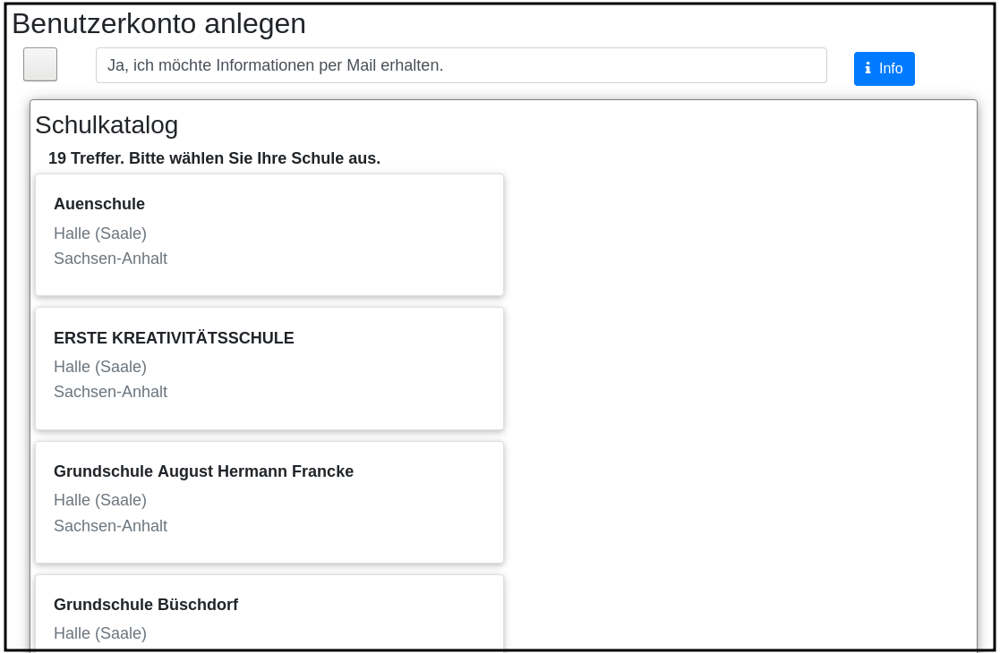

*Hat der Ort sehr viele Schulen*, öffnet sich ein Formular zur Schulsuche:

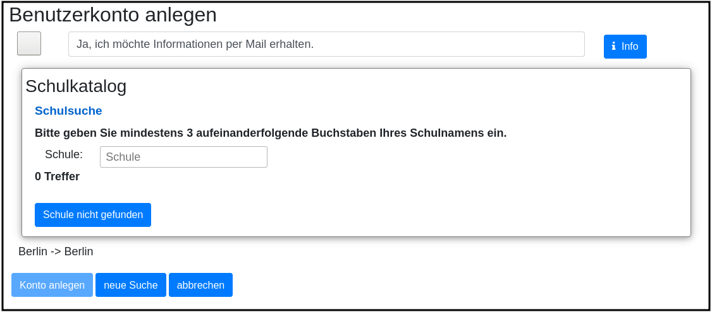

Hier geben Sie bitte 3 aufeinanderfolgende Buchstaben des Namens Ihrer Schule ein. Es empfiehlt sich, nicht unbedingt die ersten Buchstaben zu
wählen, sollte Ihre Schule "Grundschule xxx" heißen, sondern den Teil des Schulnamens einzugeben, der sich von anderen Schulnamen am deutlichsten
unterscheiden wird.

Wurden Schulen in dem Ort mit dem gegeben Namen gefunden, werden diese mit Bundesland und Ort angezeigt und Sie können Ihre Schule mit einem Klick
auswählen:

image::./images/lehrerkonto-schule-ausgewaehlt.png[width=60%]

Konnten Sie Ihre Schule im Katalog nicht finden, können Sie diese mit einem Klick auf "Schule nicht gefunden" eintragen lassen: siehe folgendes Kapitel
"Schule im Katalog nicht gefunden".

Wenn Sie die Schule gefunden haben, ist die die Schaltfläche "Konto anlegen" aktiviert. Mit Klick auf diese Schaltfläche werden Sie in ein Formular
geleitet, in das Sie die für ein Benutzerkonto erforderlichen Angaben eintragen können.

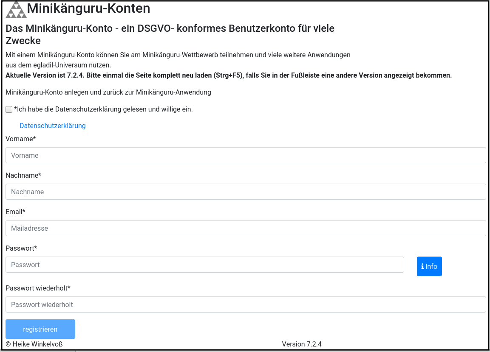

Bitte wählen Sie ein sicheres Passwort, da Sie mit diesem Benutzerkonto personenbezogene Daten der Kinder Ihrer Schule erfassen.

Ihr Name wird später allen Kolleg:innen Ihrer Schule angezeigt. Ebenso sehen Sie die Namen Ihrer Kolleg:innen.

Ihre Mailadresse wird zu keiner Zeit in der Anwendung sichbar sein. Die Mailadresse benötigen Sie, um sich später einzuloggen.

Ist das Formular vollständig ausgefüllt, senden Sie es bitte mit Klick auf die Schaltfläche "registrieren" ab. Anschließend sollten Sie eine
Erfolgsmeldung sehen:

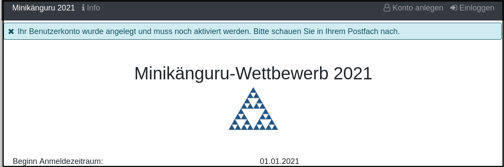

Die Information enthält den Hinweis, dass das Konto noch aktiviert werden muss. Hierzu wurde an die Mailadresse, die Sie in das Formular eingetragen
hatten, eine Mail mit einem Aktivierungslink versendet, der 24 Stunden gültig ist.

Die Mail erhalten Sie innerhalb weniger Minuten. Sollten Sie sie nicht finden, schauen Sie bitte zunächst nach, ob Ihr Mailprogramm sie als Spam
verschoben hat. Falls nicht, könnte es sein, dass Sie einen Tippfehler in der Mailadresse hatten oder die Mail nicht zugestellt werden konnte,
weil Ihr Postfach voll ist.

Wenn Sie die Mail erhalten haben, klicken Sie bitte den dort enthaltenen Link an. Bitte klicken Sie den link nur an, wenn er so aussieht:

Der rot umrandete Teil gehört zu der Webseite opa-wetterwachs.de, die mir gehört. Hinter dem rot umrandeten Teil steht ein Fragezeichen. Daran
schließt sich der blau umrandete Teil mit einem zufällig generierten Code an. *Nach dem Gleichheitszeichen dürfen nur Buchstaben und Ziffern stehen*

Wenn Sie dort also Sonderzeichen sehen, z.B. %, & oder ähnliche, handelt es sich nicht um den von mir versendeten Link. Klicken Sie einen Ihnen
verdächtig erscheinenden Link bitte *nicht* an, sondern nehmen Sie in diesem Fall per Mail Kontakt zu mir auf. Ich kann in diesem Fall Ihr
Benutzerkonto aktivieren.

Schule im Katalog nicht gefunden
--------------------------------

Wenn Sie im Schulkatalog bei der Suche nach dem Ort oder der Schule keine Treffer hatten, klicken Sie bitte auf die Schaltflächen
"Ort nicht gefunden" oder "Schule nicht gefunden", die an verschiedenen Stellen im Formular des Schulkatalogs angezeigt werden.

Sie gelangen damit in ein Formular, mit dem Sie Ihre Schule in den Katalog eintragen lassen können:

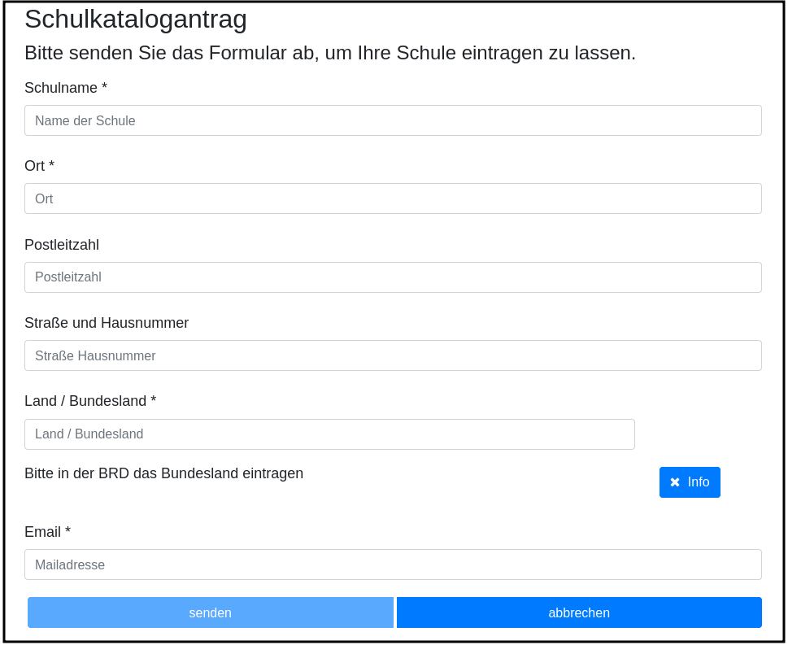

Nach dem Absenden des Formulars erhalten Sie eine Mail an die Mailadresse, die Sie eingegeben hatten. Ich trage die Schule sobald wie möglich ein,
in der Regel am Abend.

Sie erhalten eine weitere Mail, wenn ich die Schule in den Katalog eingetragen habe.

Sollten Sie die Mails nicht finden, schauen Sie bitte zunächst nach, ob Ihr Mailprogramm sie als Spam verschoben hat. Falls nicht, könnte es sein,
dass Sie einen Tippfehler in der Mailadresse hatten oder die Mail nicht zugestellt werden konnte, weil Ihr Postfach voll ist.

Einloggen und Übersichtsseite
-----------------------------

Wenn Sie erfolgreich ein Benutzerkonto für Lehrerinnen / Lehrer angelegt und dieses aktiviert haben, können Sie sich einloggen.

Rufen Sie hierzu die https://mathe-jung-alt.de/mkv-app[Startseite] der Minikänguru-Anwendung auf

image::./images/startseite-hauptmenue-login.png[width=50%]

Mit einem Klick auf den Menüpunkt "einloggen", der im Bild blau umrandet ist, gelangen Sie in ein Formular, in dem Sie bitte die Mailadresse und
das Passwort eingeben, mit dem Sie das Konto angelegt hatten.

Waren die Angaben korrekt, gelangen Sie auf Ihre Übersichtsseite:

image::./images/dashboard-lehrer.png[width=75%]

Die Kachel "Unterlagen..." sehen Sie nur dann, wenn Sie Ihre Schule (bei mehreren Schulen mindestens eine Schule)
für das aktuelle Wettbewerbsjahr angemeldet haben *und* die Unterlagen zum Herunterladen freigeschaltet sind.

Die Termine, an denen die Unterlagen freigeschaltet werden, werden in der Startseite der Minikänguru-Anwendung angezeigt. Wenn Sie eingeloggt sind,
können Sie sich die Termine jederzeit durch Klick auf den Menüpunkt "Info" oder einen Klick auf die Kachel "Infos" in Ihrer Übersichtsseite
anzeigen lassen.

Auf dieser Seite können sie auch mit einem Klick auf die Kachel "Newsletter" den Newsletter abbestellen, wenn Sie in momentan abonniert haben
oder abonnieren, wenn Sie ihn nicht abonniert haben.

Wenn Sie Ihren Namen, Ihre Mailadresse oder Ihr Passwort ändern *oder Ihr Benutzerkonto vollständig löschen* möchten. Klicken Sie bitte auf die
Kachel "Mein Profil" oder den Menüpunkt "Benutzerdaten". Sie werden dann ausgeloggt und auf in die Benutzerkontenverwaltung umgeleitet,
wo sie sich zunächst neu einloggen müssen, bevor Sie Ihre Daten ändern oder Ihr Konto löschen können.

Eigene Schulen
--------------

Da Sie mit der Minikänguru-Anwendung mit einem Benutzerkonto mehrere Schulen verwalten können, sehen Sie auf der Übersichtsseite eine Kachel mit
der Aufschrift "Meine Schulen".

Der Einstieg in die Schulliste erfolgt von Ihrer Startseite, die Sie nach dem Einloggen sehen, mit einem Klick auf die Kachel
"Meine Schulen" oder jederzeit über den Menüpunkt "Schulen" im Hauptmenü.

Beide Aktionen öffnen Ihre Schulliste.

Hier sehen Sie die Schulen, bei denen Sie sich als Lehrer:in eingetragen haben. Schulen, die bereits für den laufenden
Minikänguru- Wettbewerb angemeldet sind, sind markiert.

image::./images/schulliste-optionen.png[width=55%]

Je nach dem, ob Ihre Schule bereits zum laufenden Wettbewerb angemeldet ist oder nicht, haben Sie in der Schulliste verschiedene
Optionen. Sie können

* die Übersichtsseite der Schule aufrufen (im Bild: rot umrandete Schaltfläche)
* zur Auswertung des laufenden Wettbewerbs an dieser Schule wechseln (im Bild: blau umrandete Schaltfläche)
* sich als Lehrer:in von einer Schule abmelden (im Bild: orange umrandete Schaltfläche)
* sich als Lehrer:in einer weiteren Schule eintragen (im Bild: dunkel umrandete Schaltfläche)

Klicken Sie auf die Schaltfläche "neue Schule", wenn Sie sich als Lehrer:in einer weiteren Schule eintragen
möchten. Sie gelangen dann in den Ihnen bereits von der Registrierung bekannten Schulkatalog siehe Kapitel "Ein Benutzerkonto anlegen".

*Bitte beachten Sie:* Den Lehrer:innen, die für die jeweilige Schule ebenfalls eingetragen sind, wird Ihr Name
auf der Übersichtsseite der Schule angezeigt. Ebenso sehen Sie die Namen Ihrer Kolleg:innen.

Eine Schule anmelden
--------------------

Um eine noch nicht angemeldete Schule anzumelden, klicken Sie bitte auf den Button "Schulübersicht" dieser Schule.

Sie gelangen auf die Übersichtsseite der gewählten Schule:

image::./images/schuluebersicht-nicht-angemeldet.png[width=75%]

Wenn der Anmeldezeitraum begonnen hat, sehen Sie eine Kachel mit der Aufschrift "Anmelden". Sie melden
die Schule für den laufenden Wettbewerb durch einen Klick auf diese Kachel an.

*Die Anmeldung ist unverbindlich.* Falls Sie später am laufenden Wettbewerb doch nicht teilnehmen können,
ist das unkritisch.

Nach der Anmeldung Ihrer Schule zum laufenden Wettbewerb, sehen Sie auf der Übersichtsseite der Schule weitere
Kacheln mit denen Sie Funktionen aufrufen können, durch die Sie bei der Durchführung des Wettbewerbs an Ihrer Schule
unterstützt werden:

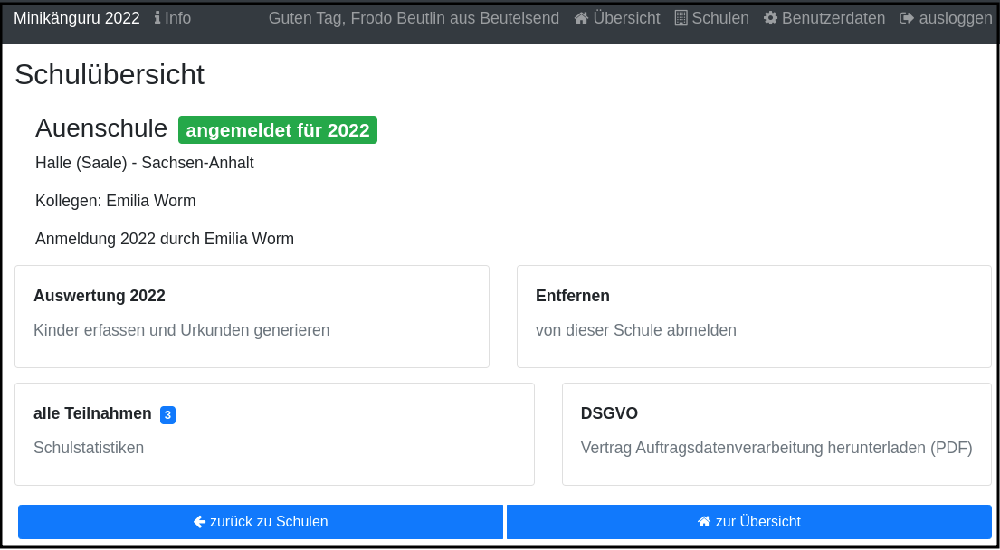

Klassenlisten als Excel hochladen
---------------------------------

Sie können alle teilnehmenden Kinder mit Hilfe von Excel-Tabellen importieren. Das erspart das zeitaufwendige manuelle Eintragen der Kinder Ihrer Schule.
Vielleicht kennen Sie eine ähnliche Funktion bereits vom Känguru- Wettbewerb.

Maske zum Hochladen einer Klassenliste
~~~~~~~~~~~~~~~~~~~~~~~~~~~~~~~~~~~~~~

Um Klassen als Excel zu importieren, gibt es 2 Einstiegspunkte:

* klick auf die Kachel "Auswertung" in der Schulübersicht (im Bild blau umrandet):

image::./images/schuluebersicht-angemeldet-optionen.png[width=50%]

* klick auf die Schaltfläche "Auswertung" in der Schulliste (im Bild blau umrandet):

image::./images/schulliste-optionen.png[width=50%]

Sie gelangen auf die Seite "(Schulname) Klassen", in der Sie Klassenlisten hochladen oder Klassen manuell anlegen können:

image::./images/klassen-erfassen-start.png[width=50%]

Mit einem Klick auf die Schaltfläche "Klassenlisten hochladen" gelangen Sie in die Ansicht "Klassenlisten hochladen":

Vor dem Hochladen können Sie festlegen, mit welcher Sprache die Kinder importiert werden sollen und ob der Nachname auf der Urkunde erscheinen soll.
Soll er nicht auf der Urkunde erscheinen, wählen Sie bitte  "JA" in der Option "Nachname als Zusatz". *Dies gilt dann für alle Kinder*.

Wenn Ihre Kinder die Aufgaben und Urkunden in Englisch benötigen, wählen Sie bitte  "JA"
in der Option "Sprache englisch". *Dies gilt dann für alle Kinder*.

Wenn Sie Klassen mit gemischten Sprachen haben, können Sie die Sprachoption mit den meisten Kindern wählen und die Sprache für die Kinder mit der
anderen Sprache später manuell korrigieren oder die Kinder nacheinander mit zwei verschiedenen Exceltabellen hochladen.

Nachdem Sie die Sparchoption ausgewählt und festgelegt haben, ob der Nachname auf der Urkunde erscheinen soll, klicken Sie bitte auf die
Schaltfläche "Datei auswählen". Es öffnet sich ein Dialog, der Ihre Dateien zeigt. Das Startverzeichnis ist browserabhängig bereits ausgewählt,
meist das Verzeichnis, aus dem Sie das letzte Mal Dateien mit dem Broser hochgeladen haben oder Ihr "Dokumente"-Verzeichnis.
Die Minikänguru-Anwendung kann dies nicht beeinflussen.

Suchen Sie hier bitte das Verzeichnis mit den Exceltabellen und klicken Sie auf die hochzuladende Datei:

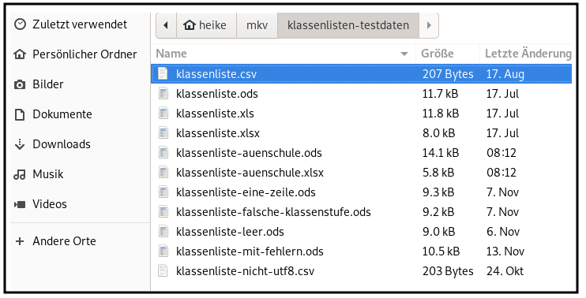

Danach wird der Name der ausgewählten Datei angezeigt und die Schaltfläche "Datei auswählen" ist durch die Schaltfläche
"hochladen" ersetzt:

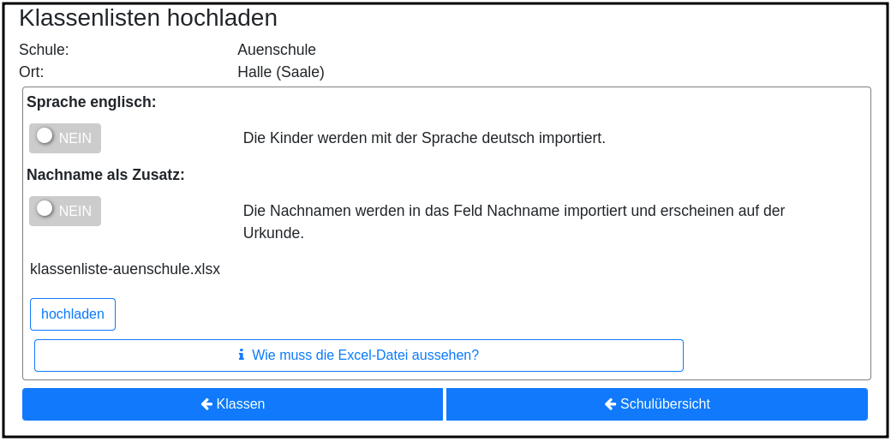

Der Import beginnt, sobald Sie die Schaltfläche "hochladen" angeklickt haben. Da der Import einige Sekunden dauern kann, wird Ihnen angezeigt,
dass Kinderdaten importiert werden, bis der Import abgeschlossen ist.

Sobald der Import beendet ist, erscheint eine Meldung. In diesem Fall ist es eine Warnung, weil einige der Einträge in der Exceltabelle nicht
problemlos importiert werden konnten.

image::./images/upload-klassenlisten-meldung.png[width=100%]

Weiter unten in der Ansicht wird ein Fehlerreport angezeigt, der mit einem Klick auf die Schaltfläche "Fehlerreport speichern"
heruntergeladen werden kann:

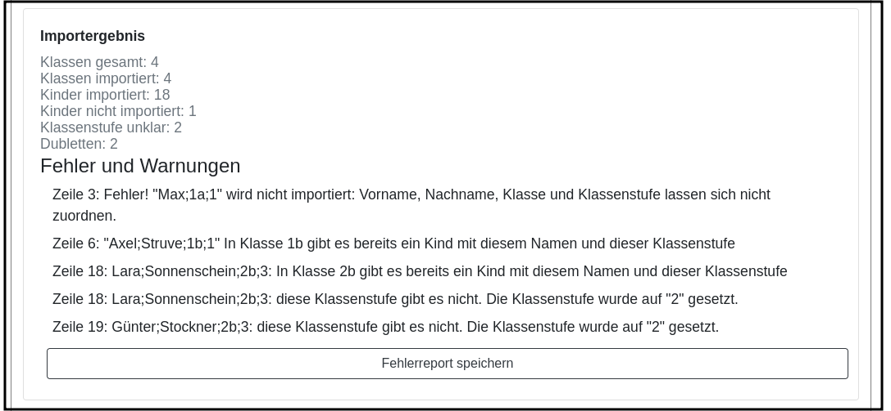

*Bitte speichern Sie den Fehlerreport sofort, da er momentan nur direkt nach dem Import der Klassenliste bereitgestellt wird.*

Das Herunterladen erfolgt mit dem Standard-Browser-Dialog zum Speichern von Dateien. Es handelt sich um eine Textdatei. Ihr Betriebssystem wird
diese nach Doppelklick mit einer geeigneten Anwendung öffnen.

Manuelle Fehlerkorrektur
~~~~~~~~~~~~~~~~~~~~~~~~

Falls sich nicht alle Kinder problemlos importieren ließen, können Sie diese nun manuell korrigieren. Wechseln Sie hierzu mit einem Klick
auf die Schaltfläche "Klassen" in die Übersichtsseite der Klassen ihrer Schule. Hier sind diejenigen Klassen auffällig markiert, bei denen Sie
die importierten Kinder noch einmal prüfen und korrigieren sollten:

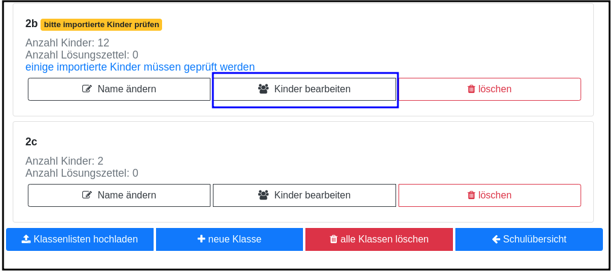

Klicken Sie bei einer betroffenen Klasse auf die im Screenshot blau umrandet dargestellte Schaltfläche "Kinder bearbeiten". In der Kinderliste
sind die Kinder gekennzeichnet, die Sie noch einmal prüfen und ggf. korrigieren sollten:

image::./images/upload-klassenlisten-kinder-fehler.png[width=75%]

Versehentlich doppelt erfasste Kinder können Sie einfach löschen. Gibt es tatsächlich 2 Kinder mit gleichem Vor- und Nachnamen und der gleichen
Klassenstufe in dieser Klasse (sehr unwahrscheinlich), erfassen Sie bitte nach Klick auf "ändern" für jedes Kind einen unterschiedlichen
Zusatztext, damit Sie später die Urkunde richtig zuordnen können.

Wenn die Klassenstufe unklar war (also nicht 0, 1 oder 2), wurde
beim Import die Klassenstufe auf 2 gesetzt. Dies können Sie mit dem Schiebeschalter bestätigen oder nach Klick auf "ändern" korrigieren.

Haben Sie alle Kinder der Klasse korrigiert, betätigen Sie bitte einmal den Schiebeschalter "Prüfung Import abgeschlossen" unterhalb der
Liste der Kinder:

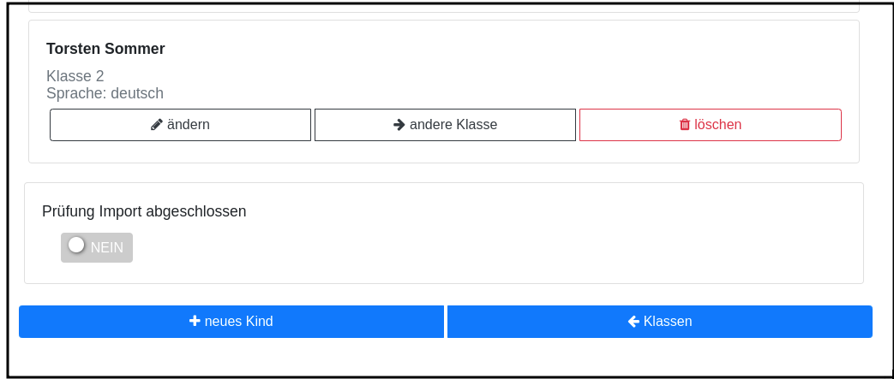

*Tipp:*

Sollten sich zu viele Fehler eingeschlichen haben, geht es vermutlich schneller, alle Klassen zu löschen,  die Exceldatei zu korrigieren anschließend
noch einmal hochzuladen.

Sie können alle importierten Daten auf einmal löschen, indem Sie in der Klassenübersicht Ihrer Schule die Schaltfläche "alle Klassen löschen" anklicken:

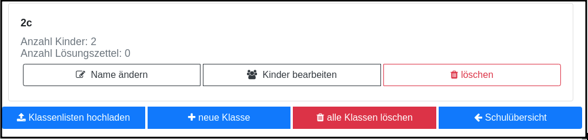

Nach der Bestätigung des Warndialogs werden alle Kinder und Klassen vollständig gelöscht. Daher ist Vorsicht von Nöten, falls Ihre Kolleg:innen
bereits Klassen und Kinder erfasst oder importiert haben. In diesem Fall sollten Sie Ihre eigenen Klassen besser einzeln löschen.

Format der Excel-Dateien zum Hochladen der Klassenlisten
~~~~~~~~~~~~~~~~~~~~~~~~~~~~~~~~~~~~~~~~~~~~~~~~~~~~~~~~

Sie können alle Kinder Ihrer Schule mit einer einzigen Datei hochladen oder jede Klassenliste einzeln nacheinander hochladen. Die Exceldateien
müssen dabei wie wie folgt aufgebaut sein:

* Sie dürfen nur ein einziges Tabellenblatt enthalten. Es wird beim Import immer nur das erste Tabellenblatt berücksichtigt

* Sie müssen 4 lückenlos aufeinanderfolgende Spalten mit den Überschriften *Vorname*, *Nachname*, *Klasse*, *Klassenstufe* enthalten.

* Die Spalten können in beliebiger Reihenfolge stehen. Die Zuordnung erfolgt anhand der Überschriften.

* Alle Spalten müssen vollständig gefüllt sein.

* Als Klassenstufe werden die Ziffern 0 (Inklusion), 1 (Klasse 1) und 2 (Klasse 2) erwartet. Bei einer anderen Zahl wird das betreffende Kind
zunächst mit Klassenstufe 2 importiert und markiert. Das kann nachträglich manuell korrigiert werden.

* Die Spalte *Klasse* enthält den Namen der Klasse, so wie er auf den Urkunden erscheinen soll.

* Die Klassennamen müssen nicht in irgendeiner Reihenfolge sortiert sein. Es werden so viele Klassen angelegt, wie verschiedene Klassennamen in
der Exceldatei gefunden werden.

Die Maske zum Hochladen von Klassenlisten enthält eine Schaltfläche "Wie muss die Excel-Datei aussehen". Der Dialog, der sich nach Klick auf diese
Schaltfläche öffnet, fasst die eben genannten Anforderungen noch einmal kurz zusammen:

Klassen- und Kinderdaten pflegen (manuell)
------------------------------------------

Klassen anlegen und ändern
~~~~~~~~~~~~~~~~~~~~~~~~~~

Um Klassen anzulegen oder zu bearbeiten, gibt es 2 Einstiegspunkte:

* klick auf die Kachel "Auswertung" in der Schulübersicht (im Bild blau umrandet):

image::./images/schuluebersicht-angemeldet-optionen.png[width=50%]

* klick auf die Schaltfläche "Auswertung" in der Schulliste (im Bild blau umrandet):

image::./images/schulliste-optionen.png[width=50%]

Sie gelangen in die Klassenliste, die zunächst leer ist:

image::./images/klassen-erfassen-start.png[width=50%]

Eine neue Klasse erfassen Sie nach einem Klick auf die Schaltfläche "neue Klasse":

image::./images/neue-klasse-1.png[width=60%]

Sie können alle Klassen zügig nacheinander anlegen, indem Sie jeweils nach dem Speichern die Schaltfläche "neue Klasse"
(im Bild rot umrandet) erneut anklicken

Mit Klick auf die Schaltfläche "zurück" gelangen Sie zurück in Ihre Klassenliste:

image::./images/klassenliste-mit-kindern.png[width=60%]

Für jede Klasse haben Sie folgende Optionen:

* umbenennen (Schaltfläche "Name ändern")
* Kinder eintragen oder bearbeiten (Schaltfläche "Kinder bearbeiten")
* löschen (Schaltfläche "löschen")

Sie können jede Klasse löschen, also auch Klassen, zu denen bereits Kinder eingetragen wurden. In diesem Fall öffnet sich ein
Warndialog, denn es wird dann nicht nur die Klasse vollständig gelöscht, sondern auch alle Kinder dieser Klasse:

image::./images/klasse-loeschen-warndialog.png[width=30%]

Beim Löschen einer Klasse ohne Kinder erscheint kein Warndialog.

Kinder anlegen und ändern
~~~~~~~~~~~~~~~~~~~~~~~~~~

Um zu einer Klasse Kinder zu erfassen oder die Kinder einer Klasse zu bearbeiten, klicken Sie in der Klassenliste auf
der Kachel der Klasse bitte auf die Schaltfläche "Kinder bearbeiten":

image::./images/klassenliste-mit-kindern.png[width=60%]

Sie gelangen in die Kinderliste der gewählten Klasse:

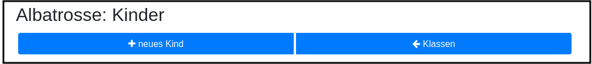

Ein neues Kind erfassen Sie nach dem Klick auf die Schaltfläche "neues Kind":

image::./images/kind-erfassen-1.png[width=60%]

Pflichtfelder sind:

* Vorname
* Klassenstufe
* Sprache

*Welche Daten werden auf die Urkunde gedruckt?*

Der Name der Klasse, zu der ein Kind gehört, erscheint auf der Urkunde. Abhängig von den übrigen Daten, die sie für die Kinder erfassen, erscheinen:

* der vollständige Name, wenn Sie für ein Kind den Vornamen *und* den Nachnamen eingetragen haben
* nur der Vorname, wenn Sie für ein Kind nur den Vornamen eingetragen haben.

Der Zusatz erscheint *nicht* auf der Urkunde.

Nachdem alle Pflichtfelder gefüllt sind, können Sie das Kind durch Klick auf die Schaltfläche "speichern" speichern.

Sie können alle Kinder einer Klasse zügig nacheinander erfassen, indem Sie nach dem Speichern sofort auf die Schaltfläche
"neues Kind" (im Bild orange umrandet) klicken.

Dabei werden die gewählte Klassenstufe und die gewählte Sprache von der vorherigen Auswahl übernommen, da diese
sich in den meisten Fällen nicht ändern.

*Tipp:* Indem Sie in einer Klasse mit gemischten Klassenstufen die Kinder der gleichen Klassenstufe nacheinander
anlegen, kommen Sie mit den wenigsten Klicks beim Anlegen der Kinder aus.

Mit einem Klick auf die Schaltfläche "zurück" gelangen Sie zurück in die Klassenübersicht:

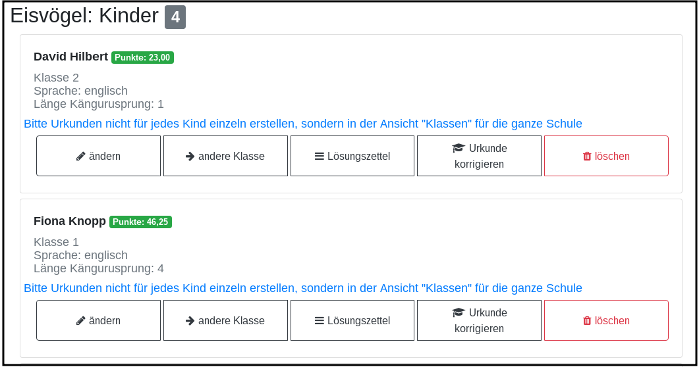

Alle Kinder der Klasse werden nach Vornamen und Nachnamen sortiert in je einer Kachel angezeigt.

Sie können durch Klick auf die entsprechenden Schaltflächen in der Kachel eines Kindes

* die Daten dieses Kindes ändern (Schaltfläche "ändern")
* das Kind in eine andere Klasse verschieben (Schaltfläche "andere Klasse")
* den Lösungszettel dieses Kindes erfassen (Schaltfläche "Lösungszettel")
* die Urkunde dieses Kindes noch einmal ausdrucken (Schaltfläche "Urkunde korrigieren")
* das Kind löschen (Schaltfläche "löschen")

*Hinweis:* Die Schaltfläche "Lösungszettel" ist nur sichtbar, wenn die Unterlagen zum Herunterladen bereitgestellt worden sind. Die Schaltfläche
"Urkunde korrigieren" ist nur sichtbar, wenn für das Kind ein Lösungszettel erfasst wurde.

Das Löschen eines Kindes bestätigen Sie bitte extra in dem Warndialog, der nach Klick auf "löschen" angezeigt wird:

image::./images/kind-loeschen-warndialog.png[width=30%]

*Mehrfacherfassungen vermeiden - der Zusatztext*

In der Schulübersicht, die Sie während der automatischen Auswertung des Wettbewerbs Ihrer Schule erstellen, werden je
Klasse alle Kinder mit Vorname, Nachname (falls eingegeben), Zusatztext (falls eingegeben) und Klassenstufe aufgelistet.

Kinder einer Klasse die in diesen Merkmalen übereinstimmen, können daher in der Schulübersicht und auf den Urkunden nicht unterschieden
werden.

Kinder werden als gleich angesehen, wenn sie

* zu gleichen Klasse gehören *und*
* die gleiche Klassenstufe haben *und*
* in Vorname, Nachname *und* Zusatztext übereinstimmen.

Falls Sie also Ihre Kinder nur mit dem Vornamen erfassen möchten, kann es vorkommen, dass es in einer Klasse mehrere Kinder
mit diesem Vornamen und der gleichen Klassenstufe gibt. Um diese Kinder in der Schulübersicht unterscheiden zu können,
können Sie einen beliebigen Zusatztext eintragen, der Ihnen bei der Unterscheidung der Kinder hilft, damit Sie später
die Urkunden korrekt austeilen können.

Potenziell sind Mehrfacherfassungen sowohl beim Erfassen von Kindern einer Klasse, als auch beim Verschieben von
Kindern zwischen Klassen möglich. Ist das der Fall, wird ein Warndialog angezeigt:

image::./images/mehrfacherfassung-kind.png[width=40%]

Der Warntext enthält dabei jeweils einen kontextbezogenen Hinweis darauf, was Sie tun können, um die Urkunde später dem
richtigen Kind aushändigen zu können. Wählen Sie im gezeigten Beispiel "nein" und tragen einen Text im Eingabefeld "Zusatz"
ein, so können Sie das Kind anschließend ohne Warnung speichern, da Sie so die Mehrfacherfassung umgangen haben.

*Kinder zwischen Klassen verschieben*

Um ein Kind in eine andere Klasse zu verschieben, klicken Sie in der Klassenliste in der Kachel des Kindes auf die
Schaltfläche "andere Klasse".

Sie gelangen in ein Formuar, in dem Sie die neue Klasse mit einer Auswahlliste wählen können (das Bild zeigt das
Formular, nachdem die neue Klasse ausgewählt wurde).

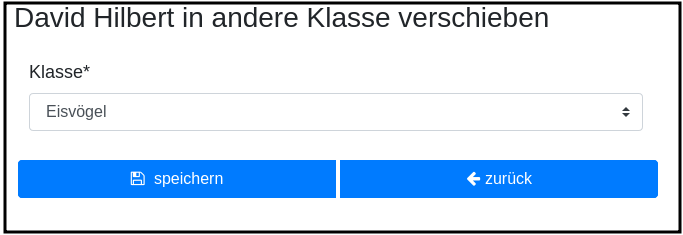

Beim Klick auf "speichern" wird automatisch überprüft, ob es ein Kind mit gleichem Namen und gleicher Klassenstufe
in der neuen Klasse bereits gibt. In diesem Fall öffnet sich wieder der Warndialog "Merfacherfassung" und Sie können das
Verschieben abbrechen. Falls es kein gleiches Kind in der neuen Klasse gibt, wird das Kind verschoben und sie finden
es anschließend in der Liste der Kinder der neuen Klasse.

Lösungszettel der Kinder erfassen
---------------------------------

Der Einstieg zum Erfassen der Lösungszettel erfolgt über Schulübersicht -> Auswertung -> "Kinder bearbeiten" -> "Lösungszettel"

image::./images/klassenliste-teilweise-vollstaendig.png[width=60%]

Kinder, für die Sie bereits einen Lösungszettel erfasst haben, erkennen Sie in der Übersicht an der grünen Markierung neben dem Namen, die die Punkte anzeigt, der Zeile
mit der Angabe der Länge des Kängurusprungs, sowie der Schaltfläche "Urkunde korrigieren".

Nach Klick auf die Schaltfläche "Lösungszettel" gelangen Sie in das Formular zum Erfassen des Lösungszettels für dieses Kind.
Das Bild zeigt das Formular für ein Inklusionskind, da hier das gesamte Formular in ein Bildschirmfoto passt:

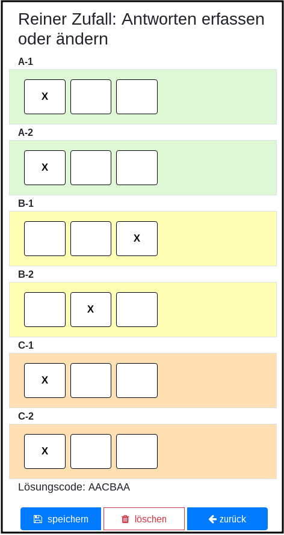

Sie sehen den Namen des Kindes und eine Tabelle mit den Aufgabennummern. Die Aufgaben in den Kategorien A (leicht), B (mittelschwer) und C (schwer) sind
jeweils mit einer anderen Farbe hinterlegt, um es zu erleichtern, den Überblick zu behalten.
Jede Zeile enthält Ankreuzkästchen, die den Ankreuztabellen auf den Aufgabenzetteln entsprechen.

Sie können also die Antworten der Kinder auf deren Arbeitsblättern einfach in diese Tabelle übertragen, indem Sie in jeder Zeile das Kästchen anklicken,
das das Kind angekreutz hat. Bei nicht gelösten Aufgaben bleibt die entsprechende Zeile leer. Ein versehentlich gesetztes Kreuz in einer Zeile können Sie
durch erneutes Anklicken wieder löschen.

Nachdem Sie alle Kreuze des Kindes übertragen haben, können Sie die Antworten speichern. Die Anwendung berechnet dann sofort die erreichte
Punktzahl und die Länge des Kängurusprungs.

Hat das Kind einen leeren Zettel abgegeben, so erhält es trotzdem Punkte und eine Urkunde. Daher
ist es möglich, einen leeren Lösungszettel zu speichern. In diesem Fall erscheint ein Warndialog:

Bestätigen Sie die Frage mit "ja", wird der leere Lösungszettel gespeichert.

Sie können einen Lösungszettel auch jederzeit löschen. Die Löschung erfolgt erst, nachdem Sie einen Warndiaog bestätigt haben.
Die Schaltfläche "löschen" ist nur aktiviert, wenn für das Kind bereits einmal ein Lösungszettel gespeichert wurde.

Nach dem Löschen gelangen Sie automatisch zurück in die Liste der Kiner dieser Klasse.

Sie können aus dem Formular "Lösungszettel" zurück in die Liste der Kiner dieser Klasse gelangen, indem Sie sie Schaltfläche "zurück" anklicken.

*Urkunde korrigieren*

In der Kinderliste einer Klasse gibt es für jedes Kind die Möglichkeit, eine Urkunde zu erstellen (Schaltfläche "Urkunde korrigieren").
Das Erstellen einer Urkunde erfordert mehrere Klicks und daher gibt es diese Möglichkeit für ein einzelnes Kind nur, um eine Urkunde zu
korrigieren, beispielsweise wenn Sie die Auswertung für die Schule mit allen Urkunden bereits erstellt hatten und feststellen, dass Sie sich
beim Namen des Kindes verschrieben hatten. Dann können Sie den Namen des Kindes korrigieren und eine einzelne Urkunde für dieses Kind noch einmal
ausdrucken.

Bitte verwenden Sie diese Schaltfläche nicht, um für jedes Kind einzeln eine Urkunde zu erstellen. Das würde viel zu lange dauern und Sie bekämen dann auch keine
Gesamtübersicht mit den Platzierungen der Kinder.

Urkunden und Schulauswertung generieren
----------------------------------------

Urkunden für die Schule generieren
~~~~~~~~~~~~~~~~~~~~~~~~~~~~~~~~~~~

Den Einstiegpunkt zum Generieren der Schulauswertung finden Sie in der Schulübersicht:
Klick auf den Menüpunkt "Schulen", Klick auf die Schaltfläche "Schulübersicht"
Ihrer Schule und Klick auf die Kachel "Auswertung...". Sie gelangen in die Ansicht mit den Klassen:

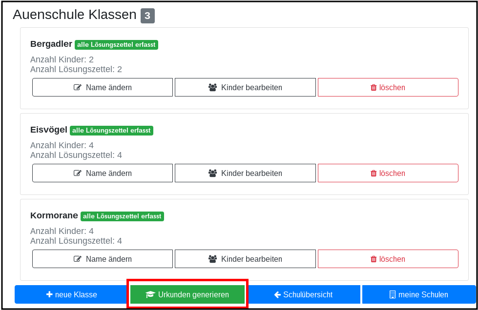

In der Leiste unter den Klassen sehen Sie eine grüne Schaltfläche "Urkunden generieren".

Bei der Schulauswertung werden nur die Kinder berücksichtigt, für die Sie Lösungszettel erfasst haben. Daher müssen Sie Kinder, die Sie bereits
eingetragen hatten, die dann aber doch nicht teilgenommen haben, nicht löschen. Sie werden am 1.8. jedes Jahres durch mich mit gelöscht.

Nach Klick auf diese Schaltfläche gelangen Sie in das Formular "Auswertung und Urkunden erstellen":

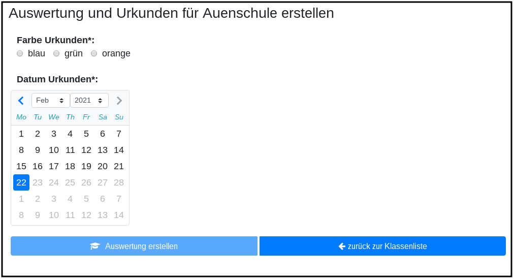

Bitte wählen Sie hier eine der 3 angebotenen Farben aus. Mit dem Kalender können Sie das Datum wählen, das auf
die Urkunden gedruckt werden soll. Voreingestellt ist das aktuelle Datum.

Oberhalb der Buttonleiste wird nach Auswahl der Farbe und des Datums angezeigt, was durch Klick auf die Schaltfläche
"Auswertung erstellen" generiert wird:

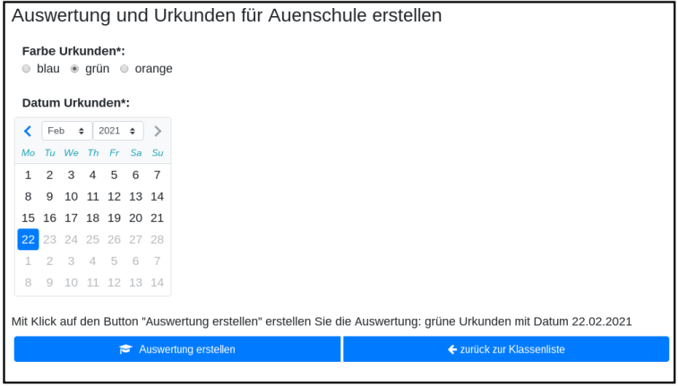

Das Generieren der Auswertung und Urkunden kann einen Moment dauern. Nach dem Fertigstellen wird je nach Browser entweder ein Dialog geöffnet (Firefox)
oder die Datei gespeichert und im unteren Browserbereich angezeigt (Chrome).

Beim Firefox öffnet sich ein Dialog:

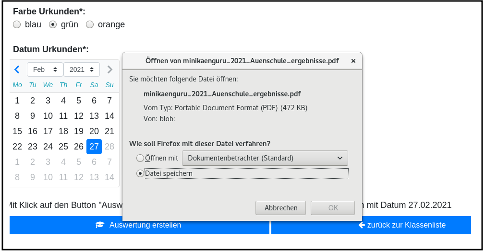

Bitte wählen Sie hier am besten die Option "Datei speichern" und bestätigen Sie mit OK.

Die Datei wird automatisch meist in das Verzeichnis "Downloads" gespeichert, von wo aus Sie sie mit Doppelcklick öffnen können.

Die ersten Seiten der Datei enthalten die Auflistung aller Kinder in der Reihenfolge ihrer Platzierungen:

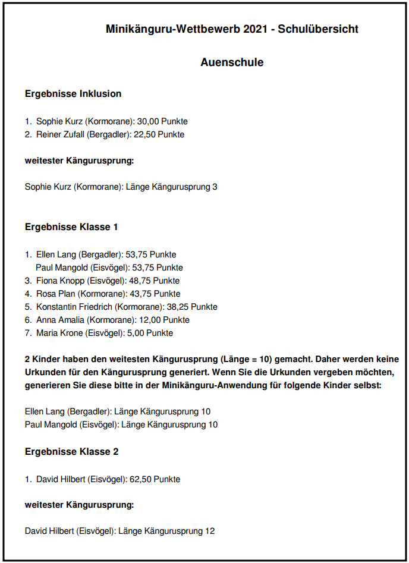

Es schließen sich die Seiten mit den Urkunden für die Kinder an.

Eine Urkunde für den weitesten Kängurusprung in einer Klassenstufe wird nur generiert, wenn es ein einziges Kind mit dem weitesten Kängurusprung gibt.
Falls das nicht der Fall war, enthält die Übersichtsseite einen Hinweistext mit den Namen der Kinder, die den weitesten Kängurusprung gemacht haben.
Sie können die Kängurusprungurkunden für diese Kinder nachträglich einzeln generieren (siehe folgenden Abschnitt).

Urkunden für einzelne Kinder generieren
~~~~~~~~~~~~~~~~~~~~~~~~~~~~~~~~~~~~~~~

Sie gelangen in diese Funktion wie folgt: Menüpunkt "Schulen" -> Schaltfläche "Auswertung ..." -> Schaltfläche "Kinder bearbeiten" auf
der Kachel, die die Klasse des Kindes anzeigt.

Klicken Sie hier auf die Schaltfläche "Urkunde korrigieren". Sie gelangen in ein Formular, das ähnlich aufgebaut ist, wie das Formular zum Generieren
der Schulauswertung.

Hier sind 2 Dinge auszuwählen: die Art der Urkunde (Teilnahme oder Kängurusprung) sowie die Farbe der Urkunde:

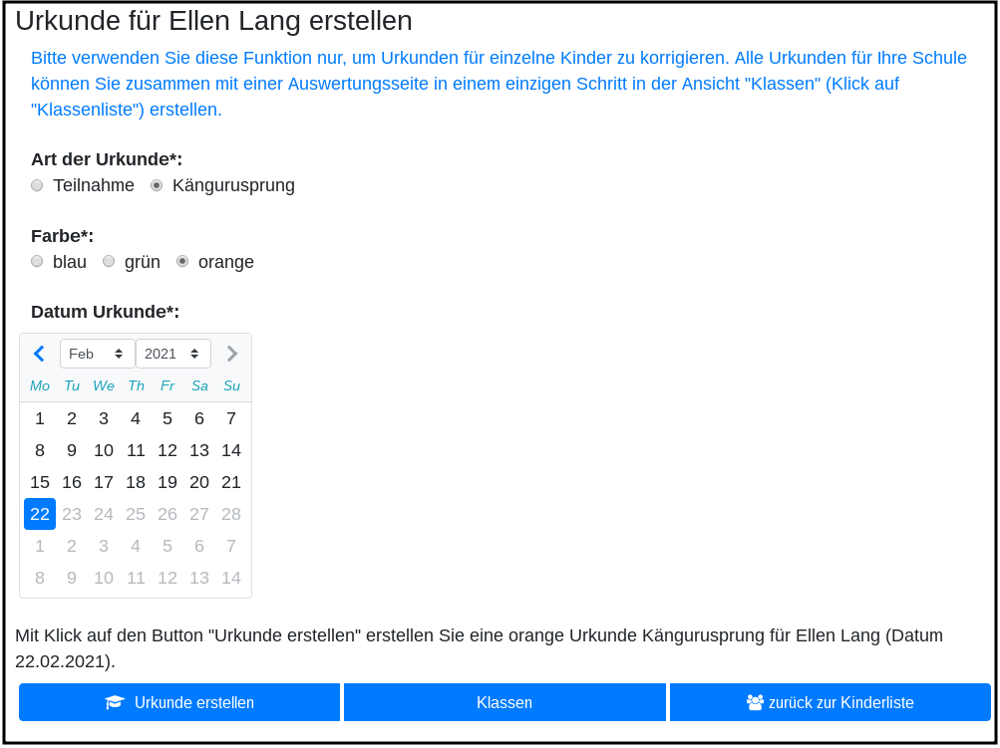

Sie können das voreingestellte Datum, das auf die Urkunde gedruckt werden soll, über den Kalender ändern.

Mit Klick auf die Schaltfläche "Urkunde erstellen" generieren Sie die Urkunde. Sie wird im Browser Chrome automatisch heruntergeladen, in anderen Browsern
öffnet sich nach Fertigstellung ein Dialog. Bitte wählen Sie hier am besten die Option "Datei speichern" und bestätigen Sie mit OK.

Die Datei wird automatisch meist in das Verzeichnis "Downloads" gespeichert, von wo aus Sie sie mit Doppelcklick öffnen können.

Nochmals der Hinweis: verwenden Sie diese Funktion nicht, um nacheinander die Urkunden für jedes Kind Ihrer Schule zu erstellen, da das sehr zeitaufwendig
wäre und Sie außerdem so keine Rangliste erhalten.

Vertrag zur Auftragsverwaltung (DSGVO)
--------------------------------------

Als Schule übertragen Sie mir durch die Nutzung der Onlineauswertung den Auftrag, Daten der Kinder Ihrer Schule zu verarbeiten. Daher schließen Sie
bitte einen Vertrag zur Auftragsverarbeitung gemäßt DSGVO Artikel 28 mit mir ab.

Das Abschließen eines Vertrages ist je Schule nur einmal erforderlich und gilt von da an für alle kommenden Jahre.

Jede Lehrer:in kann diesen Vertrag im Namen der Schule abschießen. Die Schule fungiert in diesem Fall als juristische Person. *Ihr Name wird
nicht in den Vertrag übernommen*.

Falls für Ihre Schule noch kein Vertrag abgeschlossen wurde, sehen Sie in der Schulübersicht die Kachel "DSGVO" mit dem Zusatztext "Vertrag zur
Auftragsverarbeitung abschließen" (im Sceenshot rot umrandet dargestellt):

Nach Klick auf die Kachel "DSGVO" gelangen Sie in das Formular "Vertrag zur Auftragverarbeitung...":

image::./images/auftragsverarbeitung-formular-ausgefüllt.png[width=50%]

Falls der Name Ihrer Schule nicht korrekt ist, brechen Sie bitte ab und nehmen Sie Mailkontakt mit mir auf, damit ich den Namen zunächst korrigiere.

Bevor Sie das Formular ausfüllen und absenden, können Sie den Text des Vertrages herunterladen.

Dieser Text wird bei Vertragsabschluss um die Angaben zu Ihrer Schule ergänzt. Daher muss die Anschrift der Schule vollständig und korrekt
ausgefüllt werden.

Ist das Formular vollständig ausgefüllt, wird die Schaltfläche "Vertrag abschließen" aktiviert. Klicken Sie diese bitte an. Der Vertrag wird nun
erstellt und es erscheint eine Erfolgsmeldung:

Sie können den Vertrag nun herunterladen und speichern.

Wenn für Ihre Schule ein Vertrag zur Auftragsverarbeitung abgeschlossen wurde, kann dieser jederzeit erneut heruntergeladen werden. Klicken Sie
dazu in der Übersichtsseite Ihrer Schule auf die im Bild blau umrandete Kachel "DSGVO", die nun den Zusatztext "Vertrag Auftragsverarbeitung herunterladen (PDF)" enthält

Fehlersituationen
-----------------

Hängenbleiben zwischen Login- Formular und Startseite
~~~~~~~~~~~~~~~~~~~~~~~~~~~~~~~~~~~~~~~~~~~~~~~~~~~~~

Es kommt vor, dass man das Loginformular mit Mailadresse und Password abgesendet hat, dann aber nicht in der Minikänguru-Anwendung landet, sondern wieder die Startseite
sieht, und sich erneut einloggen müsste.

*Was hilft in diesem Fall?*

Dieses Verhalten wurde bisher ausschließlich von Nutzern berichtet, die den Browser Safari verwenden. Dieser Browser wird von
mir nicht unterstützt, da der Aufwand zu hoch wäre. Bitte verwenden Sie einen der anderen Browser, z.B. Firefox, Chrome oder Edge.

Berechtigungsfehlermeldung, obwohl man eingeloggt zu sein scheint
~~~~~~~~~~~~~~~~~~~~~~~~~~~~~~~~~~~~~~~~~~~~~~~~~~~~~~~~~~~~~~~~~

Sporadisch kommt es vor, dass man eine Fehlermeldung "Sie haben keine Berechtigung, bitte loggen Sie sich ein" angezeigt bekommt, obwohl das Menü anzeigt,
man sei eingeloggt:

Wie dies zustande kommt, ist noch nicht vollständig klar. Es könnte sein, dass man sich nicht ausgeloggt hatte und nach längerer Zeit ( > 1h) die Anwendung öffnet.
Der Browser cached die Anmeldeinformation, aber die Session ist bereits abgelaufen.

*Was hilft in diesem Fall?*

Bitte klicken Sie auf "Ausloggen" und laden die Seite neu (Klick auf rot umrandeten Neuladepfeil links neben der Adressleiste oder F5 - besser Strg und F5 gleichzeitig).

